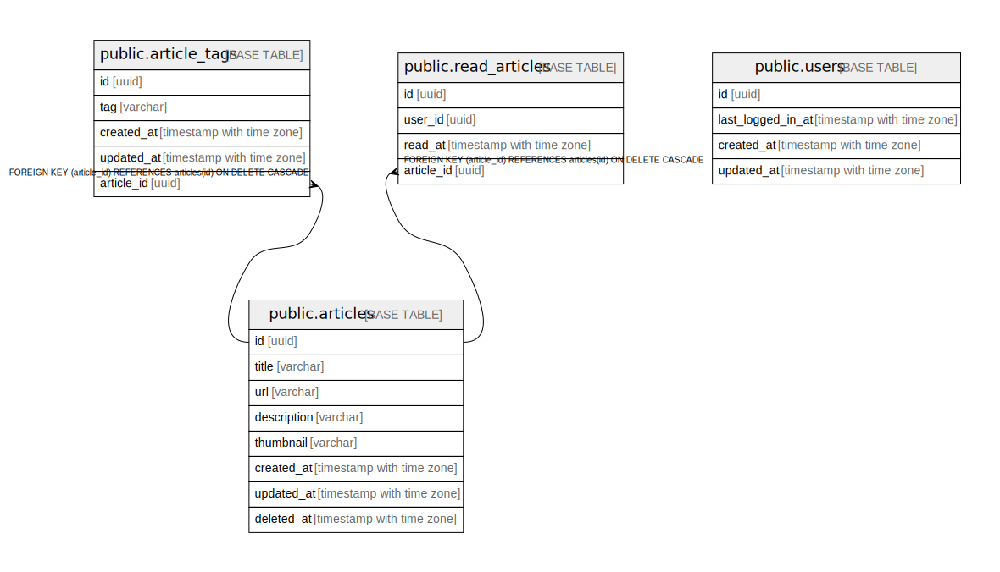

# postgres

## Tables

| Name | Columns | Comment | Type |
| ---- | ------- | ------- | ---- |
| [public.articles](public.articles.md) | 8 |  | BASE TABLE |
| [public.users](public.users.md) | 4 |  | BASE TABLE |
| [public.article_tags](public.article_tags.md) | 5 |  | BASE TABLE |
| [public.read_articles](public.read_articles.md) | 4 |  | BASE TABLE |

## Relations

---

> Generated by [tbls](https://github.com/k1LoW/tbls)
